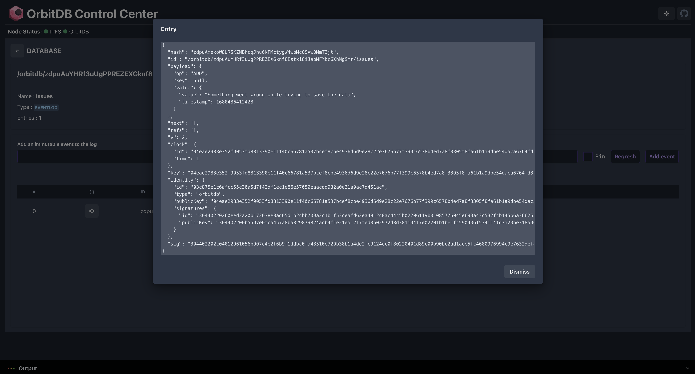

# orbit-db-control center

A control center for orbit-db. It is a web interface that allows you to create and manage orbit-db instances.

## Dashboard
  

## Explore database

## Built with
- ReactJs
- Typescript
- Vite JS
- Orbit DB
- IPFS
- Chakra UI
